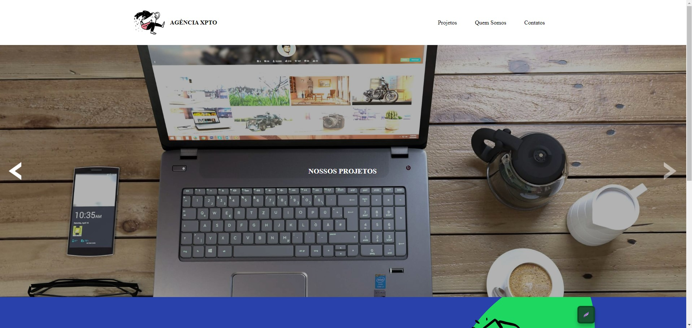
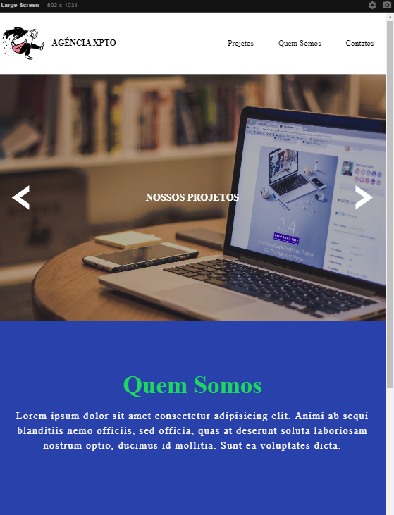
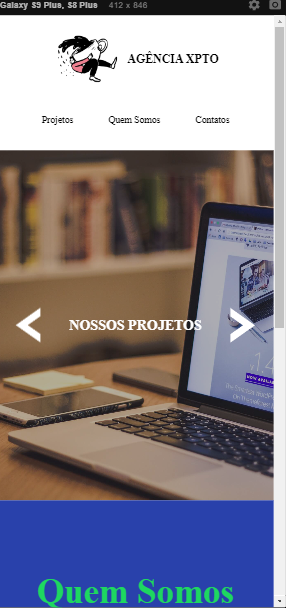

# DevQuest - JavaScript Intermediário
## Mapa devWeek - LandingPage Agencia Digital
### [Deploy](https://josuecosta2023.github.io/DevQuest-Quest-LandingPageMP/) - Clique aqui para visualizar minha pagina Web
* Baseado no projeto MAPA DEV WEEK, do curso Devquest.

# Desafio: Criar Uma landingPage com um carrosel de imagens
## Objetivos:
* Criar pagina responsiva, simples.
* Criar carrosel de imagens com javascript puro.

## Maior dificuldade:
* Entender a lógica de programação por trás do slide.

## O que aprendi?
* Aprendi a importância de separar os problemas em pequenas partes.
* Resolver cada situação de forma individual e não desistir da solução mesmo que demore um pouco.
* Como ultimo projeto de ano de 2023, me sinto orgulhoso de minha realização e minha trajetória até aqui.

## Extras
* Incrementado modulo de FAQ "Perguntas frequentes" - Realizado
* Incrementado modulo de Formulario de Contato. 

### Screenshots
* Demonstração

* Desktop
** 

* Tablet
** 

* Mobile
** 

# Author
### Josué Ocanha Costa
#### FrontEnd Developer
#### Redes Sociais

- Linkedin - [JosueOcanhaCosta](https://www.linkedin.com/in/josue-ocanha-costa/)
- Github - [JosueCosta2023](https://github.com/JosueCosta2023)
- Twitter - [@JosueOcanhaCosta](https://twitter.com/josue_ocanha)
- Facebook - [JosueCosta](https://www.facebook.com/JosueOcanhaCosta2023)
- Whatsapp - [Josue2023](https://wa.me/5565996408371?text=Ol%C3%A1%2C+encontrei+seu+whatsapp+no+Github.+Gostaria+de+falar+sobre+seus+projetos.)

# "Vida longa e próspera." 🖖🖖🖖
